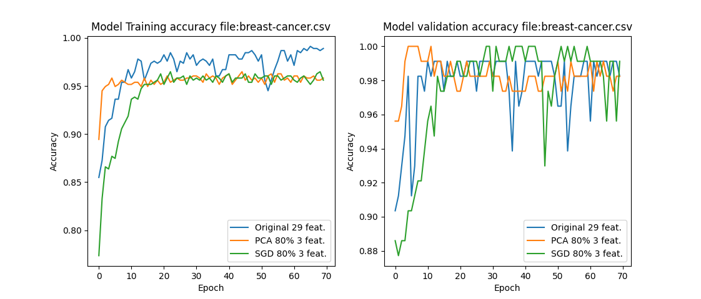

# Dimensionality Reduction

Just an exercise to be able to reduce the dimensionality of a ML Problem with two datasets.

We will use the [Sonar dataset](https://archive.ics.uci.edu/ml/datasets/Connectionist+Bench+%28Sonar%2C+Mines+vs.+Rocks%29) or the [Breast Cancer](https://www.kaggle.com/yasserh/breast-cancer-dataset) dataset that are available online

I just used this two to get binary classification and a set with no categorical values and do not have to perform OHE activities.

- In the Sonar dataset case we can see that we have 60 features file.
- IN the Breast-cancer dataset, we are talking about 29 features.

The supplied .py allow to set the variance parameter to fine tune the dimensionality reduction.

Both methods PCA and SGM are capable of reduce the feature number by a given number. 

The base model used is a DNN with a full layer of *512* units, Relu as activation, a Dropout layer of *0.2* and a *Sigmoid* to make the final classification.

What the file does:

  1. Get the data from the file and divide them into **x** (features) and **y** (labels).
  2. Train a model with the DNN explained above.
  3. After that it performs a PCA analisys, find the features responsible of 80% of the variance.
    (In this case for Sonar we keep with 10 variables and in the case of Breast-cancer we remain with 3).
  4. We generate a new model with only the 10 and 3 features.
  5. We repeathe the steps 3 and 4 for the SGM method.

## Results 
The results are the following:

for Breast Cancer dataset

and for the sonar dataset

We can see that a massive reduction of 90% in the case of Breast Cancer and 83% in the case of the Sonar file in the computations needed does not change the result drastically. Even in the case of sonar it performs better. the the full-featured data. These reductions will be more important when we have more layers and not a single one. 
